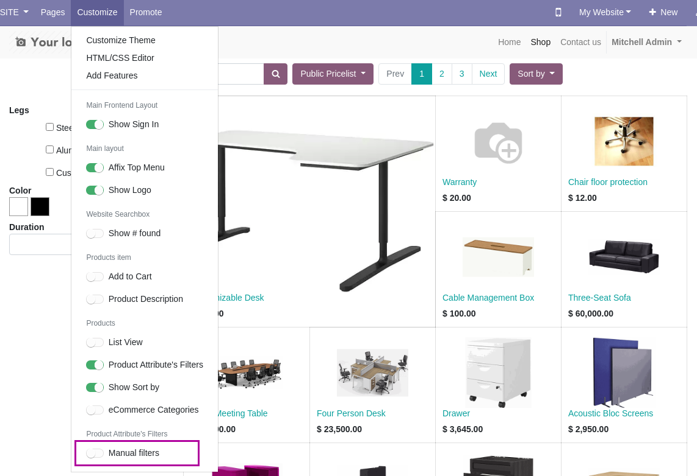

To configure this module, you need to:

1.  Go to the frontend /shop url of the website you want to set the
    manual filters into.
2.  Hit the Configure menu and enable the option *Manual filters*.

