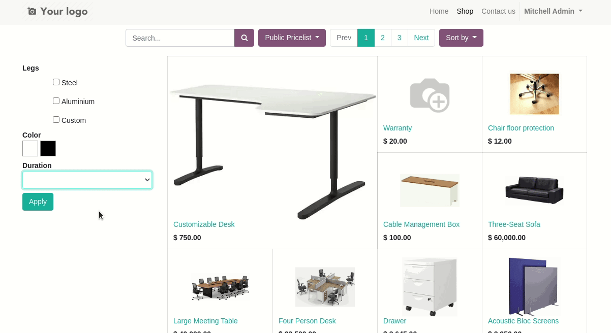

When manual filter are active, the user can set as many filters as desired and then
hit the submit button to apply them. This allows to set several filters at once, which
isn't always possible with the automatic behavior.

