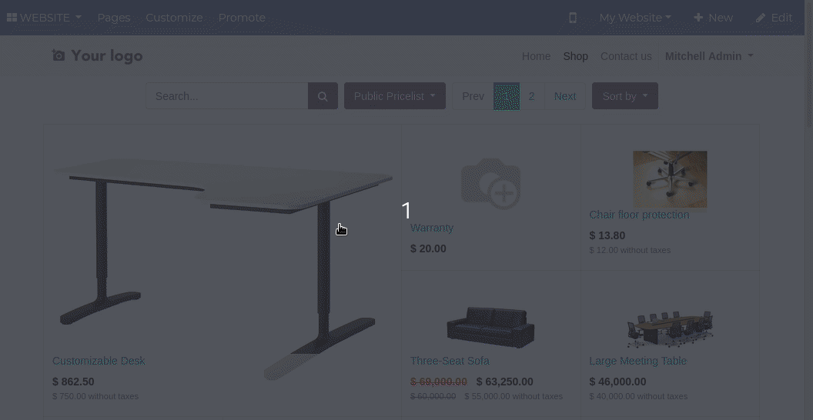
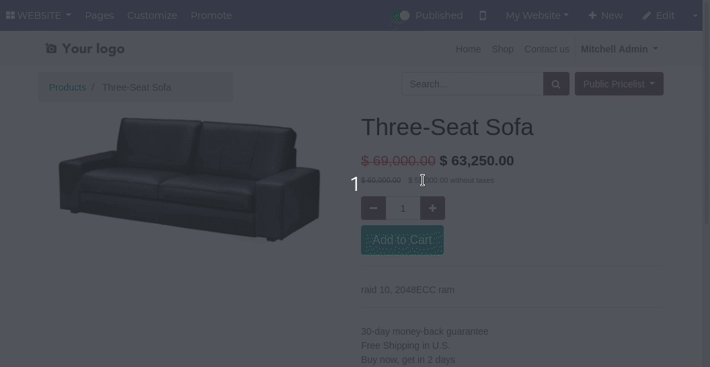

To choose if you want to display or not the alternative price in the website
products list, just enable or disable the feature from the "Customize" menu.
This can be done independently per website:

You can also toggle the behavior similarly in the product details page.
This can also be done independently per website:

