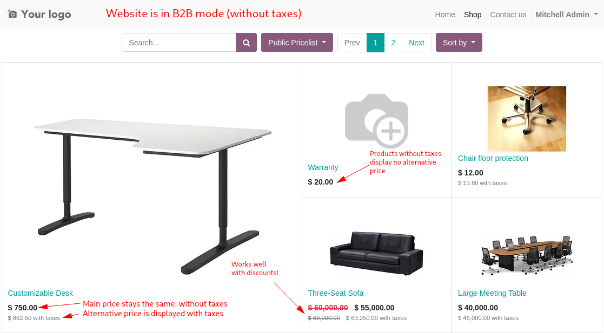
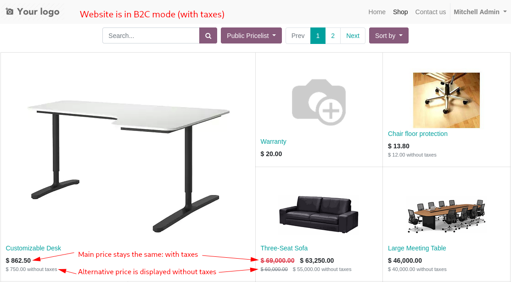
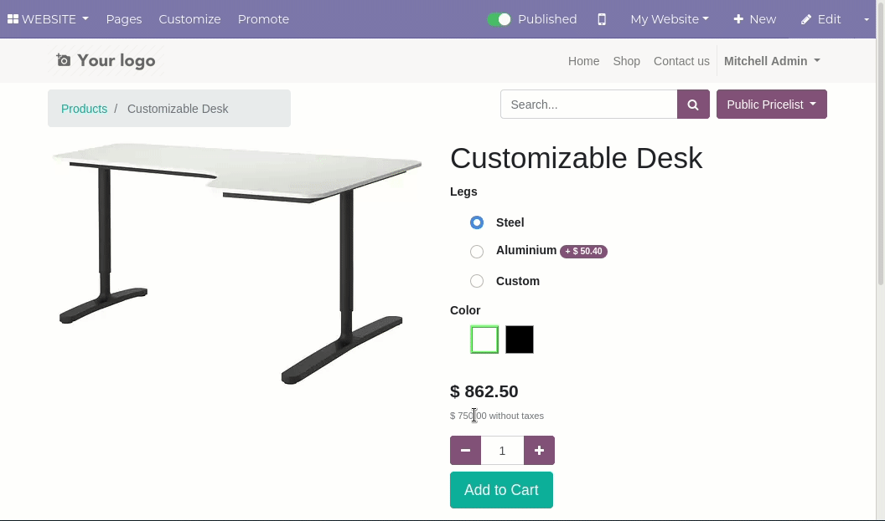

This module takes into account if your eCommerce is in B2B or B2C mode, and
displays the alternative pricing next to the main one.

For example, if your website is B2B (main price is without taxes), you would
see it similar to this:

If your website is B2C (main price is with taxes), then it looks like this:

It also displays the alternative price, including discounts, updated
automatically when the user is choosing alternatives in the product detail
page:

