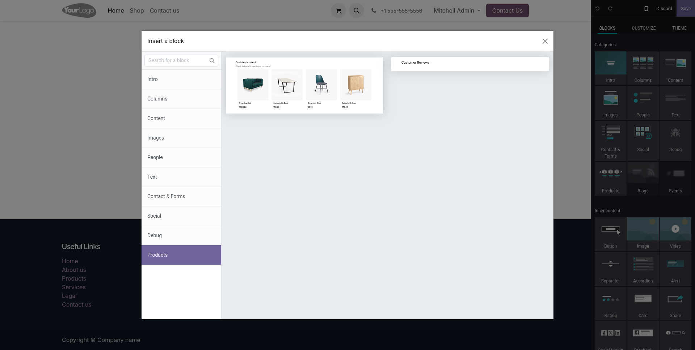
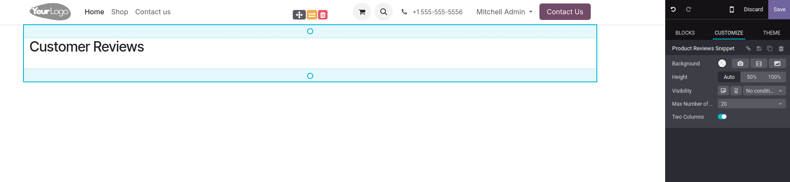
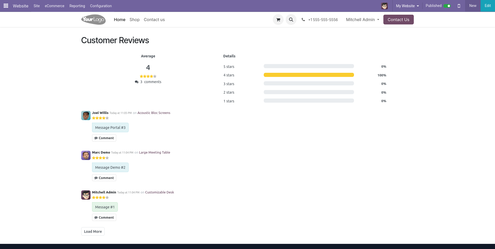

To use this module:

1. Go to the Website application. 

2. Open the Website Builder (Edit → Add Blocks). 

3. In the "Products Snippets" section, drag and drop **Customer Reviews** into your page. 

    

4. Configure the snippet by adjusting the maximum number of reviews (default: 20, max: 100) and set two columns option. 

    

5. Save your changes and publish the page. 

   The snippet will now display the aggregated reviews with rating stars, reviewer details, and comments. 

    
