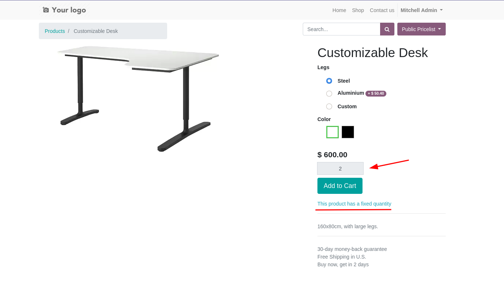
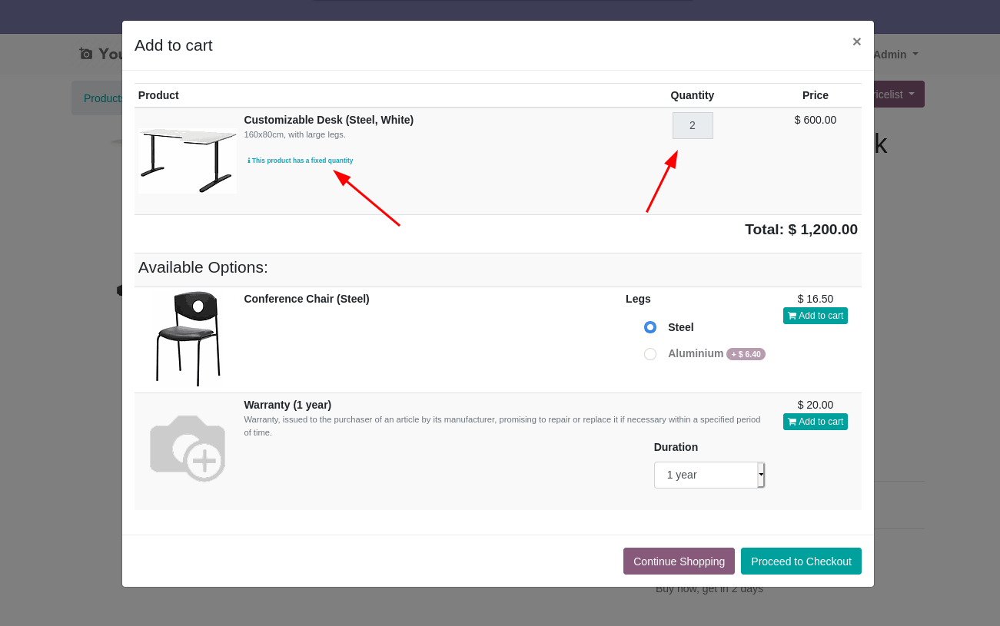
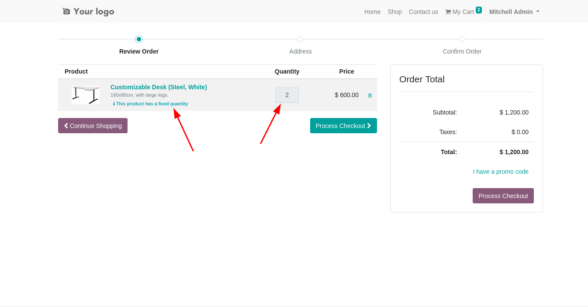

#. Go to the product template form in the backend.
#. In the "eCommerce" tab, set **Force quantity in website** to a value different
   than 0.
#. Go to Website Shop.
#. Click in the product that you edited.
#. You won't be able to choose a quantity.

