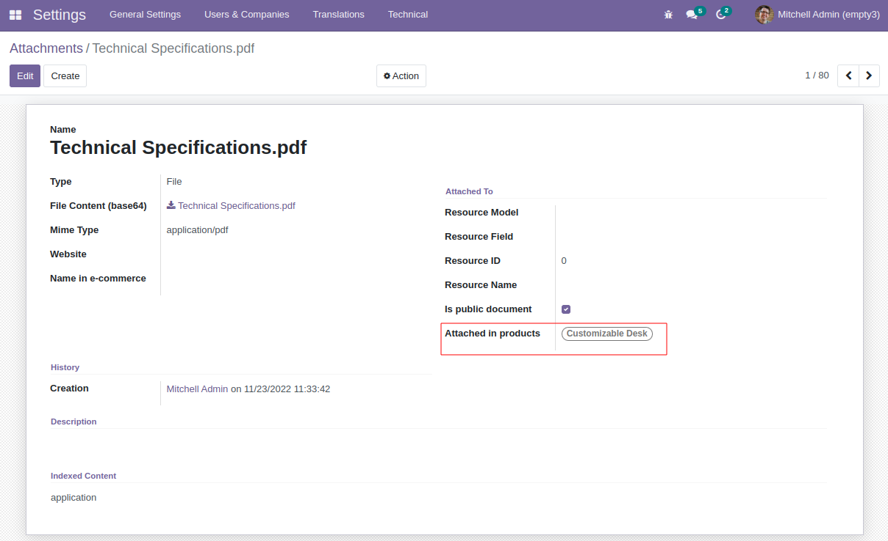
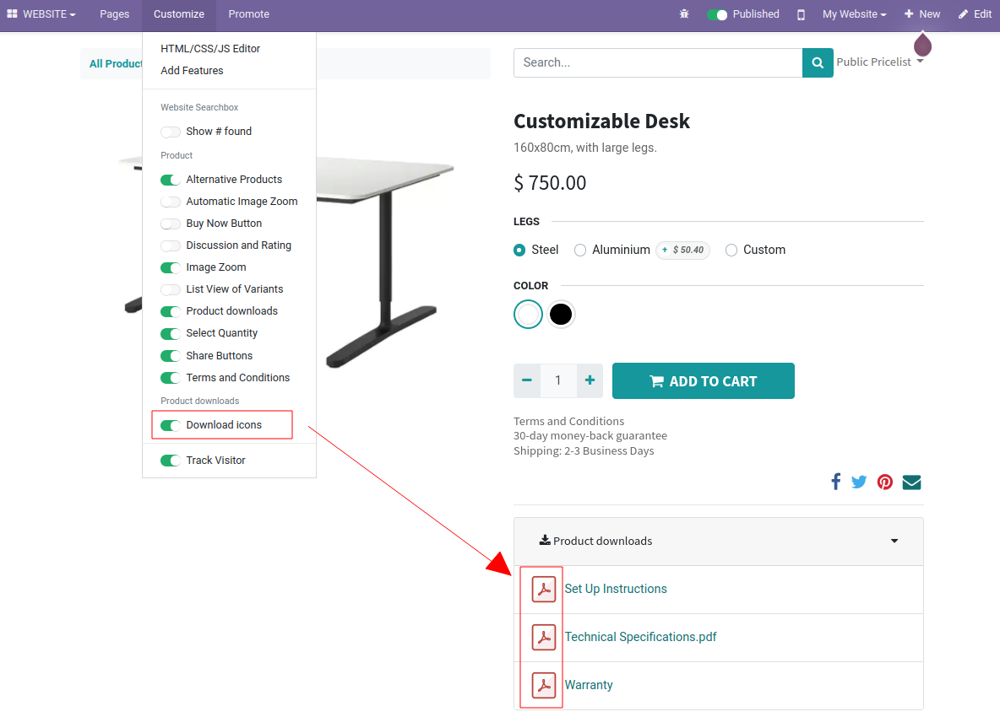

Instead of configuring attachments per product, to configure products per attachment:

#. You need permissions to access system settings.
#. Go to *Settings > Dashboard > Activate the developer mode*.
#. Go to *Settings > Technical > Database Structure > Attachments*.
#. Pick or create one.
#. Enable *Attached To > Is public document*.
#. Use the field *Attached in product templates* to choose the products.

To be able to filter attachments per website:

#. Go to *Website > Configuration > Settings > Website > Features*.
#. Enable *Multi-Websites*.
#. Save.

To toggle attachment icons in the website:

#. Go to any product in your eCommerce.
#. Toggle *Customize > Product downloads > Download icons*.

