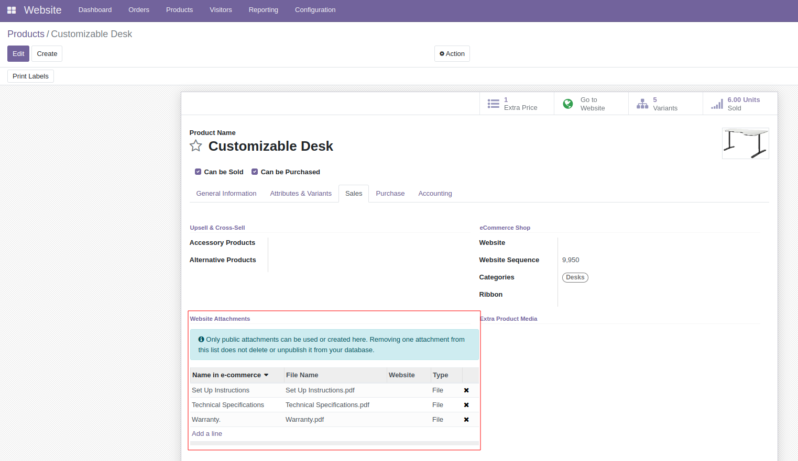
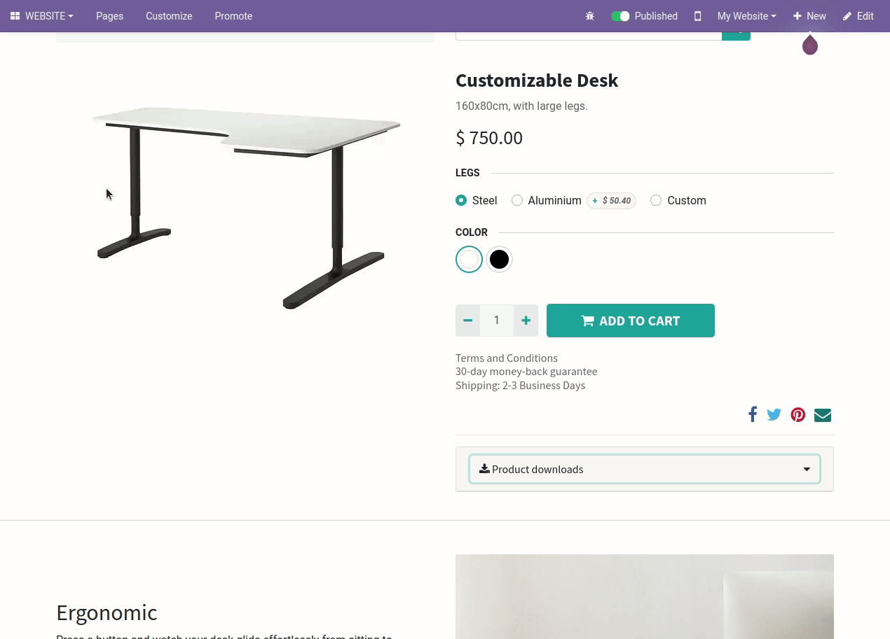

To add publicly downloadable attachments to a product template:

#. Go to a *Website > Products > Products* in backend.
#. Pick or create one.
#. Go to the *eCommerce* tab > *Website Attachments*.
#. Add any downloadable attachments you want there. They can exist before or be new.
   They must be public.
#. Save.

Once you set up the product attachments, public users will be able to download them:

#. Go to the product eCommerce page.
#. Below the product price and description, you will find a dropdown labeled as *Product downloads*. Click it.
#. Users will download those attachments from there.
#. Attachments will appear in name order.

