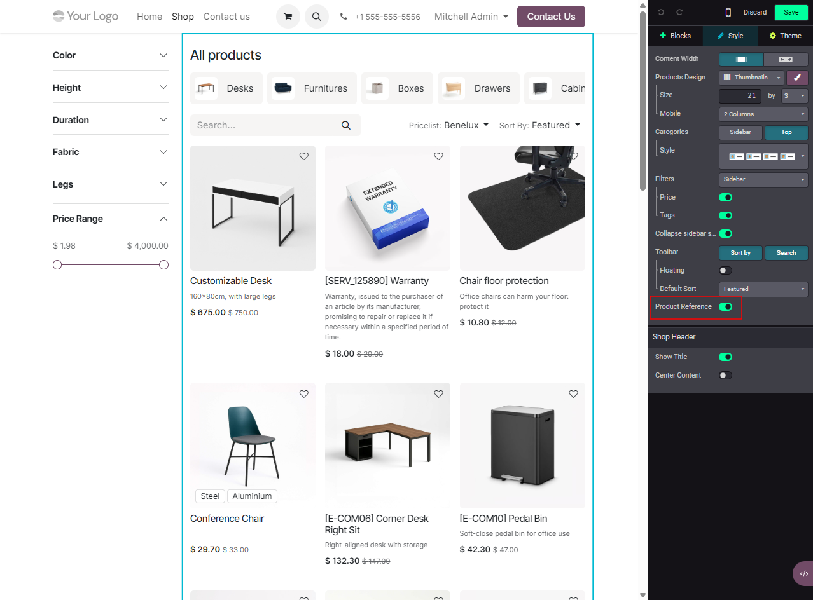

Just install and the products will be shown with their full display name
(internal reference included).

To toggle the display per page type, open the website editor and use the
**Product Reference** checkbox in the builder sidebar:

- On the **shop listing page** (`/shop`): the option appears under the
  *Products Page* section.
- On a **product detail page** (`/shop/<product>`): the option appears
  under the *Product Page* section.

Disabling the option hides the reference from the product name in the
selected area. Each website can have its own setting.

