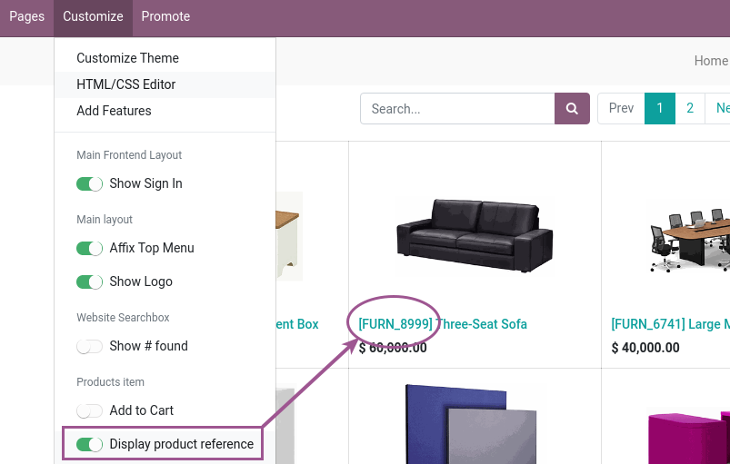

Just install and the products will be shown with their full display name.

You can enable or disable for each template and website in the *Customize* frontend
menu setting the *Display product reference* option on or off.

