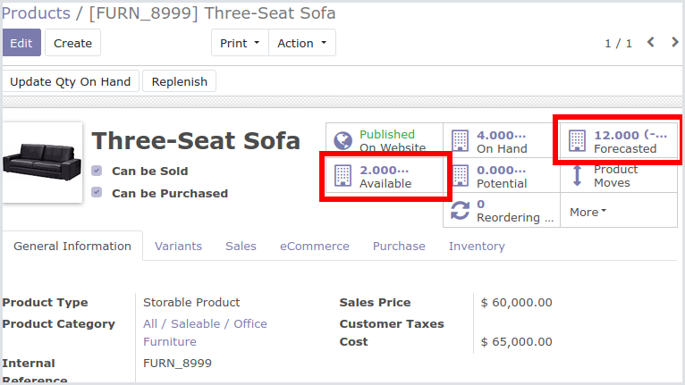

This module extends the functionality of 'Product Availability' module
(Technical name: website_sale_stock) so that for the 'Website shop' the
'Available' quantity of a product is taken into account instead of
'Forecasted' quantity.

This image shows where you can see those quantities:

|

If a product is configured to 'prevent sales if not enough stock'
(see configuration section) and its page is accessed in the Website Shop,
the availability messages will be based on the 'Available' quantity instead of
'Forecasted' quantity. And also, the Website shop wont allow you to buy more
products than 'Available' quantity (not 'Forecasted' quantity is taken
into account).
