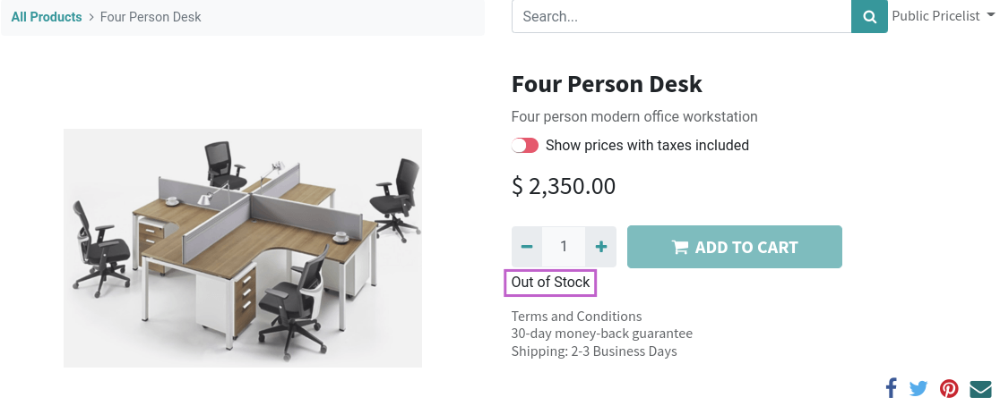

To use this module, you need to:

#. Go to your Website shop.
#. Select a product that you has previously configured to 'prevent sales
   if not enough stock' for the web product page.
#. Odoo doesn't allow you to add the product to the car if 'Available'
   quantity (not 'Forecasted' quantity) is equal or less than zero.
   Besides, availability messages will be based on the 'Available'
   quantity instead of the 'Forecasted' quantity.

