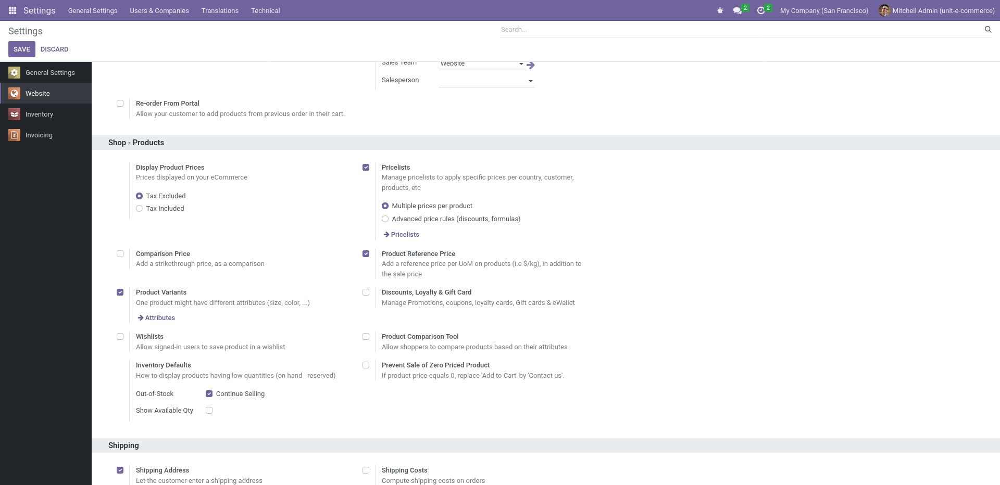
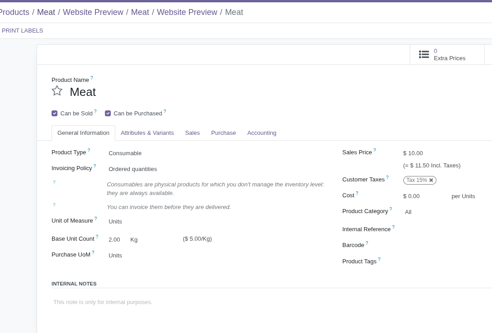

Go to Website > Configuration > Settings and activate
*Product Reference Price* under *Shop - Products* group.

Configure your products with a *Sales Price* and a *Base Count Unit*. If
*Base Count Unit* is different than zero, the *Reference Price* appears
on the web shop.

